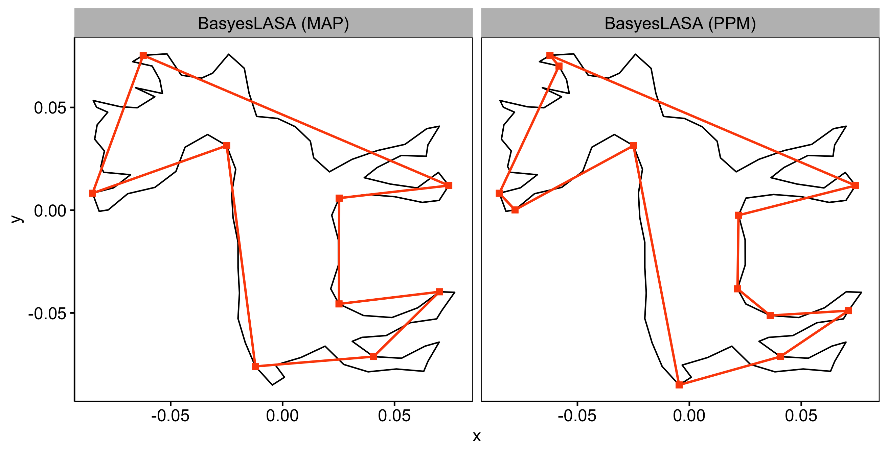

# BayesLASA

We proposed a framework called Bayesian Landmark-based Shape Analysis (BayesLASA) for landmark detection in polygonal chain data.

Here is a simple demo on how to use BayesLASA for landmark identification.

### Content

* `code`: codes for BayesLASA

  * `landmark_detection/MCMC_shape.cpp`: BayesLASA function
  
  * `landmark_detection/sim_polygon_gaussian.R`: function to generate simulated polygons
  
  * `toolbox/functions.R`: utilized functions for related analysis
  
* `manuscript_reproducibility`: files to reproduce the analysis in the BayesLASA manuscript

* `demo`: toy dataset for BayesLASA function demo


#### Landmark identification function

`MCMC_shape` function in `code/landmark_detection/MCMC_shape.cpp`

Usage:

```{r}
MCMC_shape(dat,  iter = n,  estK = est.K, gamma_i = gamma_i, alpha_sigma = 3, beta_sigma = beta_sigma, ppm_store = T)

####################
# input argument
#
# dat: polygonal chain
# iter: interations for MCMC, default = 100*n, where n is total number of points in the chain.
# estK: estimated number of landmark points, default = 3
# gamma_i: initial gamma, if not speficifed, will generate a random one
# alpha_sigma: default = 3
# beta_sigma: default = 1/n for normalized chain
# ppm_store: if return the ppm matrix
# 
# output
# 
####################
```

#### Case study

Complex shape example in MPEG-7 benchmark (http://www.dabi.temple.edu/∼shape/MPEG7/dataset.html) computer vision.

```{r}
set.seed(9080)
##load pkgs
library(mcclust) 
library(Rcpp)
library(doParallel)
library(foreach)
registerDoParallel(4)
library(R.matlab)

sourceCpp("code/landmark_detection/MCMC_shape.cpp")
source("code/toolbox/functions.R")

##*  read deer dataset
f = "demo/MPEG7closed.mat"
mdat <- readMat(f)$C.cl
k = 461 #deer shape
pc = cbind(mdat[1,,k], mdat[2,,k])

##* pre-process data, scale
temp = pc_normalizor(pc)
dat = temp$pc;
dat = dat[-nrow(dat),]
n = nrow(dat)

##* set hyper parameter and algorithm setting
fold = 100
est.K = round(n/100)
if(est.K <3){est.K = 3}
beta_sigma <- 0.001 

##* 4 MCMC chains
res = foreach(i = 1:4) %dopar%{
  #generate gamma_0
  gamma_i = generate_gamma(n, est.K)
  #run MCMC
  MCMC_shape(dat,  iter = n*fold,  estK = est.K, gamma_i = gamma_i,
             alpha_sigma = 3, beta_sigma = beta_sigma, ppm_store = T)
}

##* post infer
burnin = res[[1]]$burn
iter = res[[1]]$iter
ppm <- matrix(0, 100, 100)
for(i in 1:4){
  ppm = ppm+res[[i]]$ppm
  if(max(res[[i]]$posteriors) > current_post){
    current_post = max(res[[i]]$posteriors)
    L_map = which(res[[i]]$gamma_map > 0) # select map based on posteriors
  }
}

ppm = ppm/4
z_ppm <- minbinder(ppm, method = "comp")$cl
##* landmar points position
L_ppm = which(diff(c(z_ppm[n], z_ppm)) != 0)

##* plot
pc <- as.data.frame(dat)
colnames(pc) <- c("x", "y")
landmark_ppm <- pc[L_ppm,] %>% mutate(method = "BasyesLASA (PPM)")
landmark_map <- pc[L_map,] %>% mutate(method = "BasyesLASA (MAP)")
landmarks <- landmark_ppm %>%
  rbind(landmark_map)

p_deer = ggscatter(landmarks, x = "x", y = "y", color = "#FC4E07", size = 2, shape = 15)+
  geom_polygon(data = as.data.frame(pc), aes(x = x, y = y), fill = NA, linetype = "solid",
               size = 0.5, color = "black") +
  geom_point(data = landmarks, aes(x = x, y = y), colour = "#FC4E07", size = 2, shape = 15)+
  geom_polygon(data = landmarks, aes(x = x, y = y), colour = "#FC4E07",fill = NA, size = 0.8)+
  facet_wrap(~method) +
  theme(strip.text=element_text(size=12, colour="black"),
        strip.background=element_rect(colour="grey", 
                                      fill="grey"), panel.border =element_rect(fill=NA))
p_deer
ggsave("demo/deer_application.png")

```

