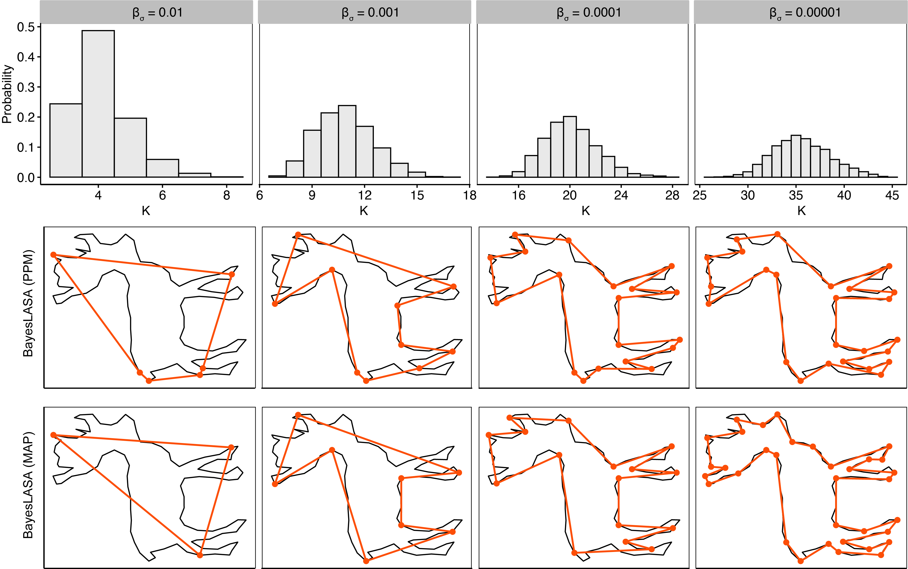

# BayesLASA

We propsed a framework called Bayesian Landmark-based Shape Analysis (BayesLASA) for landmark detection in polygonal chain data.


#### Landmark identification

MCMC_shape

Usage:

```{r}
MCMC_shape(dat,  iter = n,  estK = est.K, gamma_i = gamma_i, alpha_sigma = 3, beta_sigma = beta_sigma, ppm_store = T)

#####
# argument
#
# dat: polygonal chain
# iter: interations for MCMC, default = 100*n, where n is total number of points in the chain.
# estK: estimated number of landmark points, default = 3
# gamma_i: initial gamma, if not speficifed, will generate a random one
# alpha_sigma: default = 3
# beta_sigma: default = 1/n for normalized chain
# ppm_store: if return the ppm matrix
#####
```

#### Case study

Complex shape example in MPEG-7 benchmark (http://www.dabi.temple.edu/∼shape/MPEG7/dataset.html) computer vision.

```{r}
##load pkgs
library(mcclust) 
library(Rcpp)
library(doParallel)
library(foreach)
registerDoParallel(6)
library(R.matlab)


sourceCpp("codes/MCMC_shape.cpp"))
source("codes/functions.R")

#### read deer dataset
f = "inputdata/MPEG7closed.mat"
mdat <- readMat(f)$C.cl
k = 461 #deer shape
pc = cbind(mdat[1,,k], mdat[2,,k])


##pre-process data, scale
temp = pc_normalizor(pc)
dat = temp$pc;
dat = dat[-nrow(dat),]
n = nrow(dat)

###set hyper parameter and algorithm setting
fold = 1000
est.K = round(n/100)
if(est.K <3){est.K = 3}

## 4 MCMC chains
res = foreach(i = 1:4) %dopar%{
  #generate gamma_0
  gamma_i = generate_gamma(n, est.K)
  #run MCMC
  MCMC_shape(dat,  iter = n*fold,  estK = est.K, gamma_i = gamma_i,
  alpha_sigma = 3, beta_sigma = beta_sigma, ppm_store = T)
}

##post infer

##ppm
burnin = res[[1]]$burn
iter = res[[1]]$iter
L_map = which(res[[1]]$gamma_map > 0)
current_post = max(res[[1]]$posteriors)
for(i in 1:4){
  ppm = ppm+res[[i]]$ppm
  PPI = PPI+res[[i]]$PPI
  if(max(res[[i]]$posteriors) > current_post){
    current_post = max(res[[i]]$posteriors)
    L_map = which(res[[i]]$gamma_map > 0)
  }
}

ppm = ppm/4
z_ppm <- minbinder(ppm, method = "comp")$cl
L_ppm = which(diff(c(z_ppm[n], z_ppm)) != 0)


```
